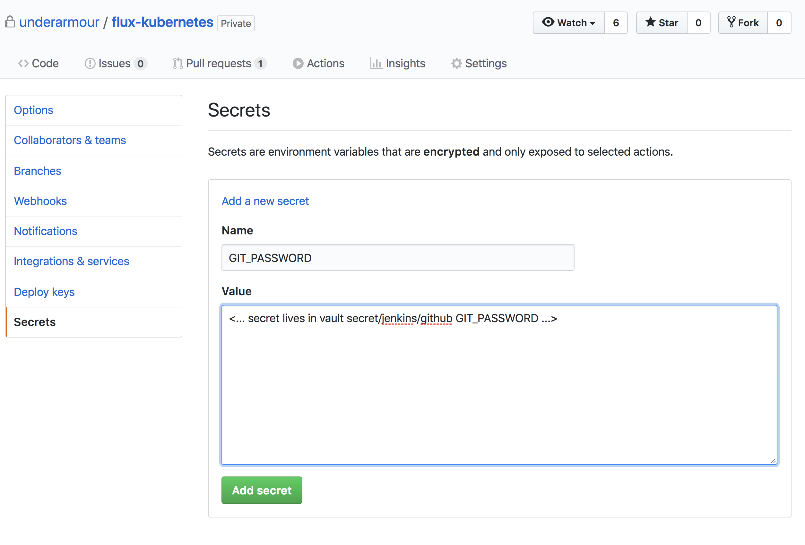

Flux CD
-------

This github action performs a continous deleivery of your kubernetes manifests to the underarmour flux repository

## Setup

To configure this action on your github repository you need to do the follow:

1. Have a github workflow defined in your project - `./.github/main.workflow`
2. Add the following as an action and place it in your resolves list for you workflow. Example:
```
workflow "CD" {
  on = "push"
  resolves = ["flux-cd"]
}

action "flux-cd" {
  uses = "underarmour/github-actions/flux-cd@master"
  secrets = ["GIT_PASSWORD"]
}
```
3. Retreive the github bot password from vault https://vault.uacf.io at the location `secret/jenkins/github`
4. Add a github secret to your project https://github.com/underarmour/<REPO NAME>/settings/secrets 

5. Commit the changes to your repo.
6. Profit - you're k8s yaml will end up in the https://github.com/underarmour/flux-kubernetes repo

## Convention

The tool is built on convention over configuration so in your repository you need to have certain filepaths and these will be copied over to the flux repo if they exists with the following

LOCAL REPO PATH -> FLUX REPO PATH
- `ops/global` -> `global/automated/$GITHUB_REPOSITORY_NAME`
- `ops/us` -> `us/automated/$GITHUB_REPOSITORY_NAME`
- `ops/china` -> `tokyo/automated/$GITHUB_REPOSITORY_NAME`